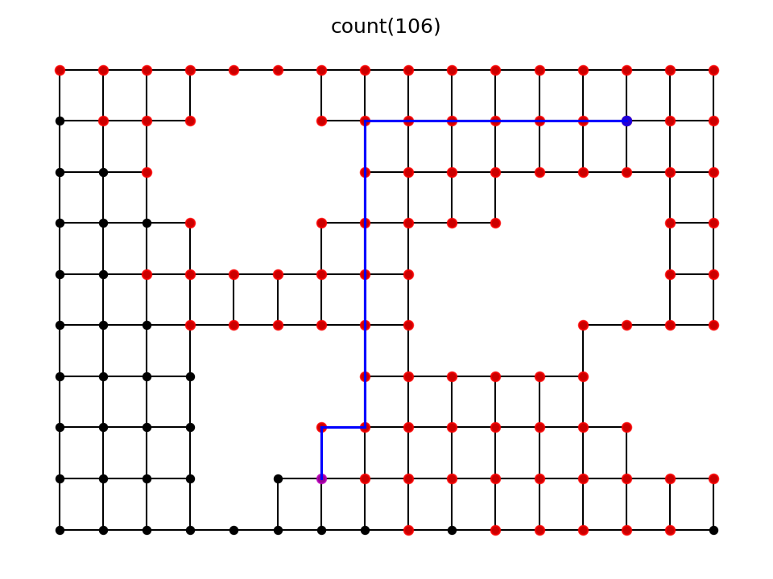
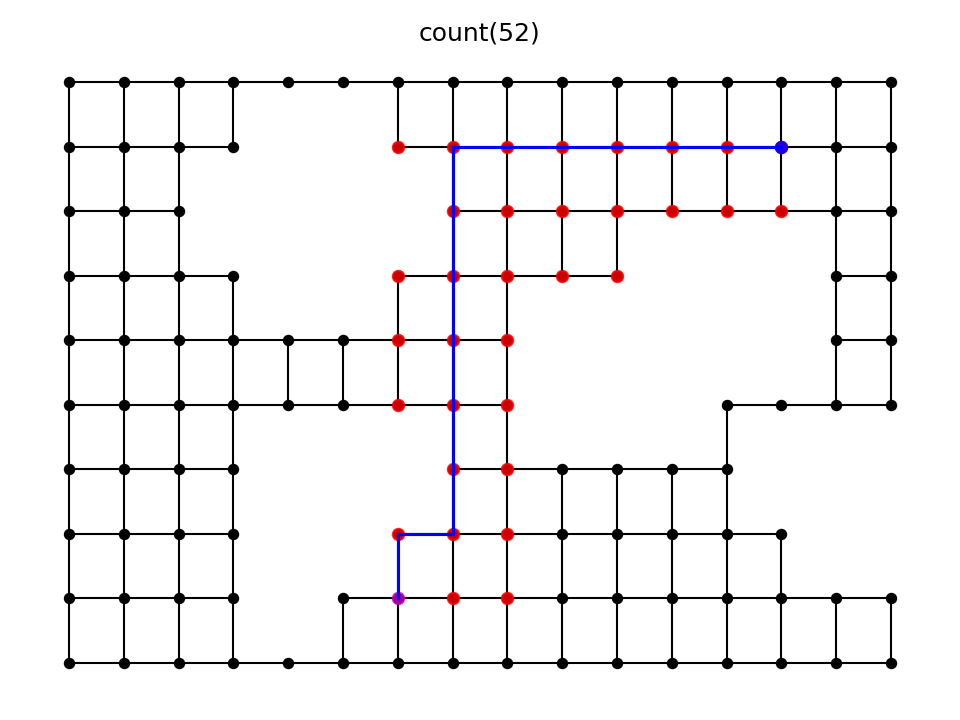
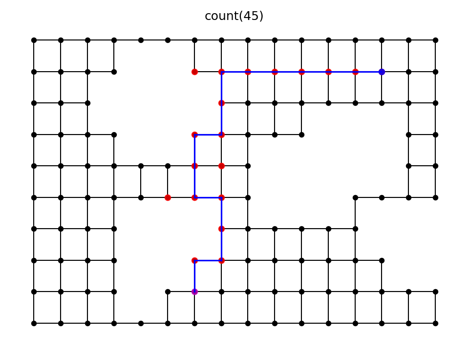

# PyGridAstar

- Implementation of Astar search (copy&paste from networkx).
- Running examples on grid graphs.
- Examples of using astar search as
   - Dijkstra (W=0)
   - Astar (W>0)

# Examples

